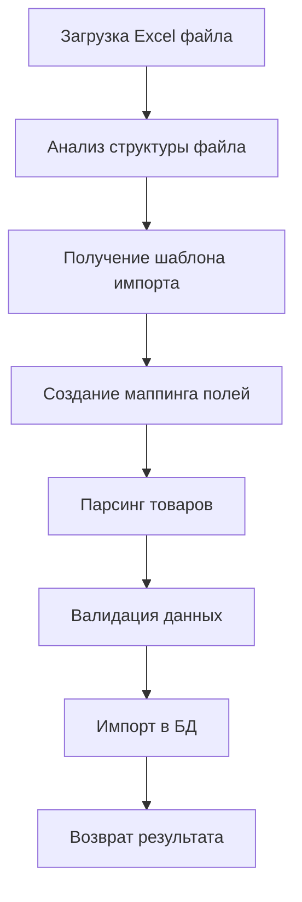
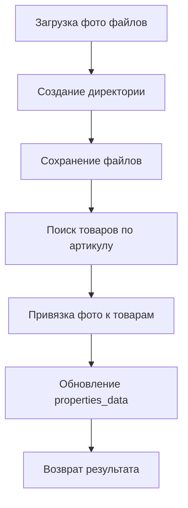

# Анализ системы импорта товаров и фото DOMEO

## Обзор системы импорта

Платформа DOMEO имеет сложную многоуровневую систему импорта товаров и фото с несколькими компонентами и проблемными областями.

---

## 1. Компоненты системы импорта

### 1.1 Основные API эндпоинты

#### **Импорт товаров:**
- `/api/catalog/products/import` - основной импорт товаров из Excel
- `/api/admin/import/universal` - универсальный импорт с динамической схемой
- `/api/admin/import/simplified` - упрощенный импорт без маппинга
- `/api/admin/import-templates/import` - импорт по шаблонам
- `/api/admin/import/[category]` - импорт по категориям

#### **Импорт фото:**
- `/api/admin/import/photos` - основная загрузка фото
- `/api/admin/import/photos-improved` - улучшенная загрузка фото

### 1.2 Сервисы импорта

#### **ProductImportService** (`lib/services/product-import.service.ts`)
- Основной сервис для импорта товаров из Excel
- Поддерживает шаблоны импорта
- Валидация данных
- Анализ структуры файла

#### **SimplifiedProductImportService** (`lib/services/simplified-product-import.service.ts`)
- Упрощенный импорт без сложного маппинга
- Прямое соответствие заголовков Excel и полей шаблона

---

## 2. Процесс импорта товаров

### 2.1 Основной поток импорта



### 2.2 Шаблоны импорта

#### **Структура ImportTemplate:**
```typescript
{
  id: string;
  catalog_category_id: string; // Один шаблон на категорию
  name: string;
  required_fields: string;     // JSON массив обязательных полей
  calculator_fields: string;   // JSON массив полей для калькулятора
  export_fields: string;       // JSON массив полей для экспорта
  field_mappings: string;      // JSON маппинг полей
  validation_rules: string;    // JSON правила валидации
}
```

#### **Проблема с маппингом полей:**
- `field_mappings` хранится как JSON строка
- Нет стандартизации названий полей
- Разные источники данных используют разные названия

---

## 3. Процесс импорта фото

### 3.1 Основной поток импорта фото



### 3.2 Алгоритм поиска товаров для фото

#### **Проблема с дублированием ключей:**
```typescript
// Список возможных ключей для поиска артикула
const possibleKeys = [
  mappingProperty,           // Оригинальный ключ
  'Артикул поставщика',      // Вариант 1
  'Артикул',                 // Вариант 2
  'SKU',                     // Вариант 3
  'sku',                     // Вариант 4
  'Артикул_поставщика',      // Вариант 5
  'Артикул поставщика',      // Дубликат варианта 1
  'Supplier SKU',            // Вариант 6
  'Supplier_sku'             // Вариант 7
];
```

---

## 4. Проблемы системы импорта

### 4.1 Дублирование названий свойств

#### **Источники проблемы:**

1. **Разные источники данных:**
   - Excel файлы от поставщиков
   - CSV файлы из 1С
   - Ручной ввод данных
   - Импорт из других систем

2. **Отсутствие стандартизации:**
   - "Артикул поставщика" vs "Артикул_поставщика"
   - "SKU" vs "sku" vs "Артикул"
   - "Название модели" vs "Модель" vs "Наименование"

3. **Проблемы с кодировкой:**
   - Разные кодировки в источниках данных
   - Неправильная обработка UTF-8
   - Потеря символов при конвертации

### 4.2 Проблемы с маппингом полей

#### **В файле `import/universal/route.ts`:**
```typescript
// Создаем import_mapping
const import_mapping = {};
headers.forEach((header, index) => {
  import_mapping[`field_${index + 1}`] = header;
});
```

**Проблема:** Создаются временные ключи `field_1`, `field_2`, которые не соответствуют реальным названиям свойств.

### 4.3 Проблемы с валидацией

#### **Отсутствие проверок:**
- Нет проверки на дублирование SKU
- Нет валидации типов данных
- Нет проверки обязательных полей
- Нет нормализации названий свойств

---

## 5. Анализ конкретных проблем

### 5.1 В файле `import/photos/route.ts`

```typescript
// Ищем по всем возможным ключам свойств (из-за проблем с кодировкой)
const possibleKeys = [
  mappingProperty, // Оригинальный ключ
  'Артикул поставщика',
  'Артикул',
  'SKU',
  'sku',
  'Артикул_поставщика',
  'Артикул поставщика', // ДУБЛИКАТ!
  'Supplier SKU',
  'Supplier_sku'
];
```

**Проблема:** Один и тот же ключ `'Артикул поставщика'` указан дважды.

### 5.2 В файле `import/simplified/route.ts`

```typescript
// Заголовки Excel = Поля шаблона (прямое соответствие)
headers.forEach((header, headerIndex) => {
  if (row[headerIndex] !== undefined && row[headerIndex] !== null && row[headerIndex] !== '') {
    product.properties_data[header] = row[headerIndex];
  }
});
```

**Проблема:** Прямое использование заголовков Excel без нормализации может привести к дублированию.

### 5.3 В файле `import/universal/route.ts`

```typescript
// Создаем свойства на основе заголовков
const properties = headers.map((header, index) => {
  return {
    key: `field_${index + 1}`,  // Временный ключ
    name: header,               // Оригинальное название
    type: type,
    required: required,
    unit: unit
  };
});
```

**Проблема:** Создаются временные ключи вместо нормализованных названий свойств.

---

## 6. Рекомендации по исправлению

### 6.1 Создание системы нормализации свойств

#### **Нормализация названий:**
```typescript
const PROPERTY_NORMALIZATION_MAP = {
  // Артикулы
  'Артикул поставщика': 'supplier_sku',
  'Артикул_поставщика': 'supplier_sku',
  'Артикул': 'sku',
  'SKU': 'sku',
  'sku': 'sku',
  'Supplier SKU': 'supplier_sku',
  'Supplier_sku': 'supplier_sku',
  
  // Названия
  'Название модели': 'model_name',
  'Модель': 'model_name',
  'Наименование': 'name',
  'Название': 'name',
  
  // Цены
  'Цена': 'price',
  'Стоимость': 'price',
  'Цена ррц': 'retail_price',
  'Цена опт': 'wholesale_price'
};
```

### 6.2 Унификация процесса импорта

#### **Единый сервис импорта:**
- Создать `UnifiedImportService`
- Стандартизировать все процессы импорта
- Унифицировать обработку ошибок
- Добавить валидацию на всех этапах

### 6.3 Улучшение системы шаблонов

#### **Расширенная структура шаблона:**
```typescript
interface ImportTemplate {
  id: string;
  catalog_category_id: string;
  name: string;
  
  // Нормализованные поля
  normalized_fields: {
    [normalizedKey: string]: {
      display_name: string;
      type: 'string' | 'number' | 'boolean' | 'date';
      required: boolean;
      validation_rules?: any;
    }
  };
  
  // Маппинг источников данных
  source_mappings: {
    [sourceKey: string]: string; // sourceKey -> normalizedKey
  };
  
  // Правила валидации
  validation_rules: ValidationRule[];
}
```

---

## 7. План исправления

### 7.1 Этап 1: Анализ существующих данных
1. Проанализировать все существующие товары
2. Выявить все дублирующиеся названия свойств
3. Создать карту нормализации

### 7.2 Этап 2: Создание системы нормализации
1. Создать `PropertyNormalizationService`
2. Реализовать нормализацию названий свойств
3. Добавить валидацию и проверки

### 7.3 Этап 3: Рефакторинг системы импорта
1. Обновить все API эндпоинты импорта
2. Интегрировать нормализацию в процесс импорта
3. Добавить транзакции и откат изменений

### 7.4 Этап 4: Тестирование и валидация
1. Протестировать импорт с различными источниками данных
2. Проверить корректность нормализации
3. Убедиться в отсутствии дублирования

---

## 8. Заключение

Система импорта DOMEO имеет серьезные проблемы с дублированием названий свойств товаров. Основные причины:

1. **Отсутствие стандартизации** названий свойств
2. **Разные источники данных** с разными соглашениями
3. **Проблемы с кодировкой** при импорте
4. **Отсутствие нормализации** на этапе импорта
5. **Множественные API эндпоинты** с разной логикой

Для решения этих проблем необходимо создать единую систему нормализации свойств и унифицировать процесс импорта.
