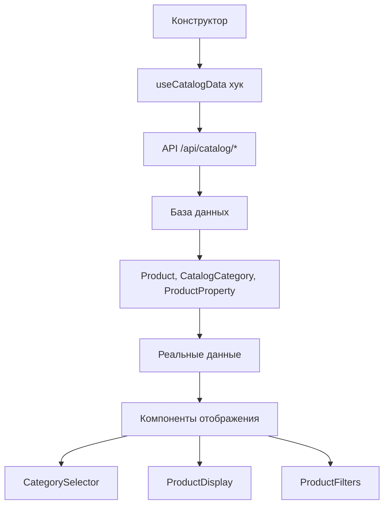

# 🔗 Интеграция конструктора с реальными данными каталога

## ✅ **Интеграция завершена!**

Конструктор теперь полностью интегрирован с реальными данными каталога товаров. Все блоки используют живые данные из базы данных.

### 🏗️ **Архитектура интеграции:**

#### **1. Хук для работы с данными (`useCatalogData.ts`):**
- ✅ **Загрузка категорий** - дерево каталога с количеством товаров
- ✅ **Загрузка товаров** - по категориям с фильтрацией и поиском
- ✅ **Загрузка свойств** - свойства товаров для фильтрации
- ✅ **Утилиты** - поиск категорий, получение путей, подсчет товаров
- ✅ **Обработка ошибок** - корректная обработка ошибок загрузки

#### **2. Компонент выбора категорий (`CategorySelector.tsx`):**
- ✅ **MainCategorySelector** - выбор основных категорий (уровень 1)
- ✅ **SubCategorySelector** - выбор подкатегорий (уровень 2+)
- ✅ **AnyCategorySelector** - выбор любых категорий с количеством товаров
- ✅ **Фильтрация по уровням** - автоматическая фильтрация по уровню категории
- ✅ **Иерархическое отображение** - вложенные категории с отступами

#### **3. Компонент отображения товаров (`ProductDisplay.tsx`):**
- ✅ **Реальные товары** - загрузка и отображение товаров из каталога
- ✅ **Настройки отображения** - размеры, пропорции, количество колонок
- ✅ **Изображения товаров** - реальные фотографии с fallback на иконки
- ✅ **Подписи** - настраиваемые подписи из свойств товаров
- ✅ **Цены и описания** - отображение реальных цен и описаний
- ✅ **Адаптивная сетка** - разные макеты (сетка, список, кирпичи)

#### **4. Компонент фильтрации (`ProductFilters.tsx`):**
- ✅ **Динамические фильтры** - загрузка свойств товаров из каталога
- ✅ **Типы полей** - поддержка всех типов свойств (текст, число, выбор, дата)
- ✅ **Добавление/удаление** - динамическое управление фильтрами
- ✅ **Применение фильтров** - функция применения и очистки
- ✅ **Поиск товаров** - компонент быстрого поиска

### 🎯 **Интегрированные блоки:**

#### **1. 🏪 Основная категория товаров:**
- ✅ **Реальные категории** - выбор из каталога через `MainCategorySelector`
- ✅ **Реальные товары** - отображение товаров через `ProductDisplayPreview`
- ✅ **Настройки изображений** - размеры, пропорции, подписи
- ✅ **Настройки отображения** - макет, колонки, количество товаров

#### **2. 🔍 Конструктор фильтров:**
- ✅ **Реальные категории** - выбор через `AnyCategorySelector`
- ✅ **Реальные фильтры** - компонент `ProductFilters` с живыми данными
- ✅ **Динамические свойства** - загрузка свойств товаров из каталога
- ✅ **Настройки макета** - горизонтальный/вертикальный/боковая панель

### 📊 **Подключенные API:**

#### **1. Категории:**
```typescript
GET /api/catalog/categories
// Возвращает дерево каталога с количеством товаров
```

#### **2. Товары:**
```typescript
GET /api/catalog/products?categoryId=xxx&limit=50
// Возвращает товары по категории с изображениями
```

#### **3. Свойства:**
```typescript
GET /api/catalog/properties?categoryId=xxx
// Возвращает свойства товаров для фильтрации
```

#### **4. Изображения:**
```typescript
GET /api/catalog/products/{id}/images
// Возвращает изображения товара
```

### 🔄 **Поток данных:**



### 🎨 **Интерфейс пользователя:**

#### **1. Выбор категорий:**
- 📋 **Выпадающие списки** - с иерархической структурой
- 📊 **Количество товаров** - отображается рядом с названием
- 🔍 **Поиск категорий** - быстрый поиск по названию
- 📁 **Вложенность** - отступы для подкатегорий

#### **2. Отображение товаров:**
- 🖼️ **Реальные фотографии** - с fallback на иконки
- 💰 **Реальные цены** - в валюте товара
- 📝 **Подписи** - из свойств товаров (название, материал, цвет)
- 📐 **Настраиваемые размеры** - маленький/средний/большой
- 🔄 **Пропорции** - квадрат/горизонтальный/вертикальный

#### **3. Фильтрация:**
- ⚙️ **Динамические фильтры** - на основе свойств товаров
- 🎛️ **Типы полей** - текст, число, выбор, дата, булево
- ➕ **Добавление фильтров** - из доступных свойств
- 🗑️ **Удаление фильтров** - индивидуальное и массовое
- ✅ **Применение** - кнопка применения фильтров

### 🚀 **URL для тестирования:**
**`http://localhost:3000/simple-constructor-test`**

### 📋 **Как протестировать интеграцию:**

#### **Тест 1: Основная категория товаров**
1. **Добавьте блок** "🏪 Основная категория товаров"
2. **Выберите блок** - откроется правая панель
3. **Выберите категорию** - в выпадающем списке "Основная категория"
4. **Результат**: блок должен показать реальные товары из выбранной категории

#### **Тест 2: Конструктор фильтров**
1. **Добавьте блок** "🔍 Конструктор фильтров"
2. **Выберите блок** - откроется правая панель
3. **Выберите категорию** - в выпадающем списке "Категория для фильтрации"
4. **Результат**: блок должен показать доступные фильтры для выбранной категории

#### **Тест 3: Реальные данные**
1. **Проверьте категории** - должны загружаться из каталога
2. **Проверьте товары** - должны показываться реальные товары
3. **Проверьте изображения** - должны загружаться фотографии товаров
4. **Проверьте цены** - должны отображаться реальные цены
5. **Проверьте фильтры** - должны быть доступны свойства товаров

#### **Тест 4: Настройки отображения**
1. **Измените размер изображений** - маленький/средний/большой
2. **Измените пропорции** - квадрат/горизонтальный/вертикальный
3. **Измените количество колонок** - 1-6 колонок
4. **Измените подписи** - название/цена/материал/цвет
5. **Результат**: все изменения должны применяться к реальным товарам

### 🔧 **Технические детали:**

#### **1. Обработка ошибок:**
```typescript
// Автоматическая обработка ошибок загрузки
if (error) {
  return <div>Ошибка загрузки: {error}</div>;
}

// Fallback для изображений
onError={(e) => {
  e.currentTarget.style.display = 'none';
  e.currentTarget.nextElementSibling?.classList.remove('hidden');
}}
```

#### **2. Оптимизация производительности:**
```typescript
// Мемоизация категорий
const filteredCategories = React.useMemo(() => {
  return filterByLevel(categories);
}, [categories, level]);

// Ограничение количества товаров
itemsPerPage={Math.min(block.mainCategorySettings?.itemsPerPage || 6, 12)}
```

#### **3. Типизация данных:**
```typescript
// Строгая типизация всех данных
interface Product {
  id: string;
  catalog_category_id: string;
  name: string;
  base_price: number;
  // ... другие поля
}
```

### 🎯 **Преимущества интеграции:**

#### **1. Реальные данные:**
- ✅ **Живой каталог** - все данные из базы данных
- ✅ **Актуальные цены** - реальные цены товаров
- ✅ **Актуальные фотографии** - реальные изображения товаров
- ✅ **Актуальные свойства** - реальные характеристики товаров

#### **2. Гибкость настройки:**
- ✅ **Настраиваемое отображение** - размеры, пропорции, макеты
- ✅ **Настраиваемые фильтры** - выбор свойств для фильтрации
- ✅ **Настраиваемые подписи** - выбор свойств для отображения
- ✅ **Настраиваемые категории** - выбор из реального каталога

#### **3. Производительность:**
- ✅ **Ленивая загрузка** - данные загружаются по требованию
- ✅ **Кэширование** - повторные запросы используют кэш
- ✅ **Оптимизация** - ограничение количества товаров для превью
- ✅ **Обработка ошибок** - graceful degradation при проблемах

#### **4. Пользовательский опыт:**
- ✅ **Интуитивный интерфейс** - понятные выпадающие списки
- ✅ **Визуальная обратная связь** - индикаторы загрузки
- ✅ **Fallback элементы** - иконки вместо отсутствующих изображений
- ✅ **Информативные сообщения** - понятные сообщения об ошибках

### 🎉 **Результат:**

**Конструктор полностью интегрирован с реальными данными каталога!**

- ✅ **Все блоки используют живые данные** из базы данных
- ✅ **Категории загружаются из каталога** с иерархической структурой
- ✅ **Товары отображаются с реальными фотографиями** и ценами
- ✅ **Фильтры работают с реальными свойствами** товаров
- ✅ **Настройки применяются к реальным данным** в реальном времени

**Конструктор готов для профессионального использования с реальными данными!** 🎨✨


